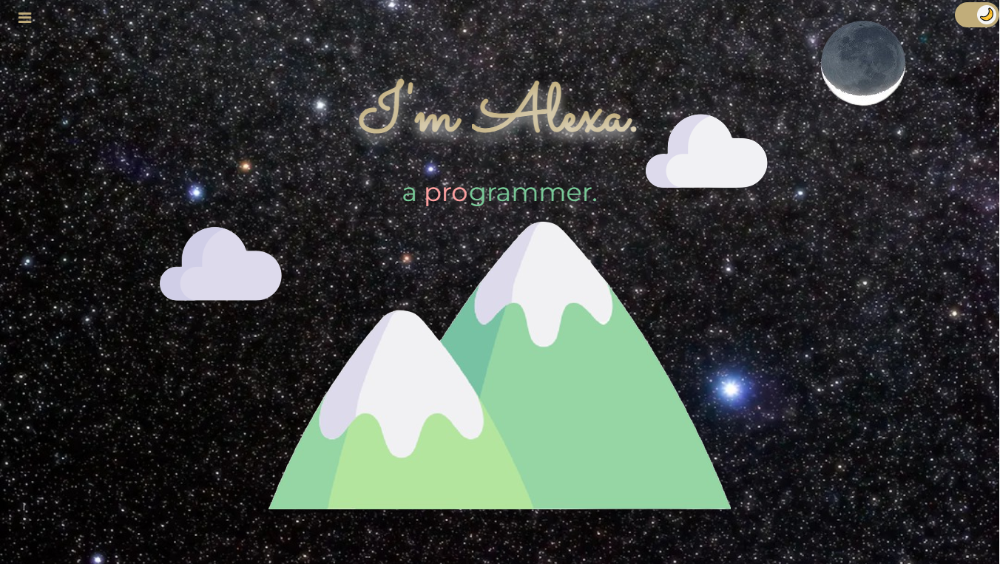
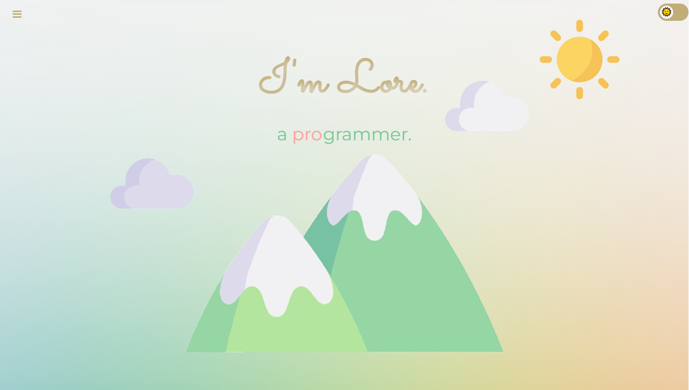

## Portafolio Personal de Alejandra Lorena Rachich

Este proyecto es la implementación de la Práctica Formativa del curso de Desarrollo web FrontEnd, perteneciente a la currícula de la Tecnicatura Superior en Desarrollo de Software, del IFTS N°29 de CABA, que consistió en el desarrollo de un portafolio personal. El objetivo principal fue reforzar habilidades de desarrollo frontend, aplicando buenas prácticas de diseño y responsividad.

Puede verse una versión en vivo de este portafolio aquí:
 https://Alexa-2k.github.io/Nuevo-Portfolio
 
 
## Características Principales
* **CSS Limpio y Estructurado:**
    * Uso de **variables CSS (`:root`)** para una gestión eficiente de colores, tipografías y espaciados.
    * Aplicación de **Flexbox** 
    * Manejo de **Box Model** (márgenes, paddings, bordes).
    * Control de elementos en bloque y en línea, **evitando el uso de ` `**.
    * **Combinadores CSS** (`>`, ` `) para una selección de elementos precisa y una mejor organización del código.
    * **Pseudoclases (`:hover`, `:active`)** en enlaces y botones para una mejor interactividad.
    * Implementación de **estilos personalizados para tablas** (filas pares/impares, hover).
    * Uso de **`z-index`** para el control de la superposición de elementos.
    * **Animaciones y Transiciones:** Inclusión de transiciones suaves en imágenes y enlaces/botones para una experiencia de usuario más dinámica.
* **Uso de Iconos:** Integración de íconos para mejorar la usabilidad y estética.

**Responsividad :** Diseño adaptativo cubriendo los siguientes breakpoints:
    * Desktop / Tablet Horizontal (`max-width: 1080px`)
    * Tablet Vertical (`max-width: 768px`)
    * Mobile 1 (`max-width: 480px`)
    * Mobile 2 (`max-width: 375px`)
    
## Tecnologías Utilizadas

* **HTML5:** Estructura semántica del contenido.
* **CSS3:** Estilado y responsividad (con enfoque en CSS puro).
* **Google Fonts:** Tipografías personalizadas (`Merriweather`, `Montserrat`, `Sacramento`).
* **Font Awesome:** Biblioteca de íconos.
* **Animate.css:** Para animaciones de elementos en la carga inicial.
* **(Opcional) JavaScript:** Utilizado para la funcionalidad del menú hamburguesa (mostrar/ocultar).

## Nota:
* **Las páginas anexas, online-sp, online-en, schedule, register están en desarrollo. No forman parte del trabajo práctico. Estoy ideando un proyecto personal a partir de este desarrollo. 

## 📂 Estructura del Proyecto
.
|-- README.md
|-- assets
|   `-- images
|       |-- EEng yellow.jpg
|       |-- Estructura.png
|       |-- Foto_oficina.png
|       |-- Magallanes_by_E_Scharberger.jpg
|       |-- Moon.png
|       |-- Noche de Observatorio1.jpg
|       |-- SPflag.png
|       |-- Sirius.jpg
|       |-- UKflag.png
|       |-- Under_construction.png
|       |-- X_logo.png
|       |-- X_logoblack.png
|       |-- astronomy.png
|       |-- baggage.png
|       |-- bckgd.jpg
|       |-- cake-decoration.png
|       |-- circled anime 192.png
|       |-- cloud1.png
|       |-- cloud2.png
|       |-- coding-circled.png
|       |-- construccion-removebg-preview.png
|       |-- cooking.png
|       |-- data analyst.jpg
|       |-- eeng robot.png
|       |-- favicon-16x16.png
|       |-- favicon-32x32.png
|       |-- favicon.ico
|       |-- fondo_lindo-flip.png
|       |-- fondo_lindo.png
|       |-- fullstack developer2.jpg
|       |-- galaxy.png
|       |-- gardening.png
|       |-- git.png
|       |-- github_green.png
|       |-- goals.png
|       |-- languages.png
|       |-- linkedin.png
|       |-- maths medium.png
|       |-- mountains.png
|       |-- nomad0.png
|       |-- nomad3a.jpg
|       |-- package-box.png
|       |-- piano-ico.png
|       |-- piano.jpeg
|       |-- plantilla.png
|       |-- qa-tester.jpg
|       |-- repos
|       |   |-- Batman.png
|       |   |-- CAC-movies.png
|       |   |-- JS-PFO.png
|       |   |-- JS-ej.png
|       |   |-- MiniAlura.png
|       |   |-- apeperia.png
|       |   |-- barberia.png
|       |   |-- conferencia.png
|       |   |-- drumkit.png
|       |   |-- encriptador.png
|       |   |-- form.png
|       |   |-- tasks-list.png
|       |   |-- televisor.png
|       |   `-- tienda-cafe.png
|       |-- sample.png
|       |-- sample2.png
|       |-- subjects
|       |   |-- Web development icons created by vectorsmar-httpswww.flaticon.com.png
|       |   |-- algebra_1.png
|       |   |-- algebra_2.png
|       |   |-- algebra_3.png
|       |   |-- astronomy.png
|       |   |-- chemistry 3.png
|       |   |-- chemistry1.png
|       |   |-- chemistry2.png
|       |   |-- electricity1.png
|       |   |-- electricity_2.png
|       |   |-- electricity_3.png
|       |   |-- elem_math.png
|       |   |-- elem_math2.png
|       |   |-- elem_math3.png
|       |   |-- elem_math4.png
|       |   |-- excel.png
|       |   |-- internet.png
|       |   |-- internet1.png
|       |   |-- internet2.png
|       |   |-- internet3.png
|       |   |-- internet4.png
|       |   |-- math 1.png
|       |   |-- math2.png
|       |   |-- math3.png
|       |   |-- rigid body naif.png
|       |   |-- rigid body.png
|       |   |-- rotation naif.png
|       |   |-- rotation.png
|       |   |-- waves.png
|       |   |-- waves1.png
|       |   |-- windows.jpg
|       |   |-- windows_word.png
|       |   |-- word.png
|       |   `-- word2.png
|       |-- sun.png
|       |-- teach00.jpg
|       |-- techs
|       |   |-- Android_Studio_Logo80.png
|       |   |-- CSS80.png
|       |   |-- Jira80.png
|       |   |-- Kotlin.png
|       |   |-- MySQL80.png
|       |   |-- MySQLinverso.png
|       |   |-- Node.svg
|       |   |-- VS.png
|       |   |-- VSC.png
|       |   |-- bootstrap80.png
|       |   |-- c80.png
|       |   |-- figma.png
|       |   |-- git.png
|       |   |-- github80.png
|       |   |-- html80.png
|       |   |-- java.png
|       |   |-- js80.png
|       |   |-- mongoDB80.png
|       |   |-- node.png
|       |   |-- php.png
|       |   |-- python-logo80.png
|       |   |-- react80.png
|       |   `-- trello.png
|       |-- telescope medium.png
|       |-- travel03a.jpg
|       |-- whatsapp.png
|       `-- white-noise.jpg
|-- components
|   |-- footer.html
|   |-- switch.html
|   `-- topnav.html
|-- css
|   |-- online.css
|   `-- style.css
|-- index-sp.html
|-- index.html
|-- js
|   |-- script.js
|   |-- tagcanvas.js
|   `-- tagcanvas.min.js
|-- online-en.html
|-- online-sp.html
|-- register.html
`-- schedule.html

8 directories, 141 files

## Muestra del Portafolio

